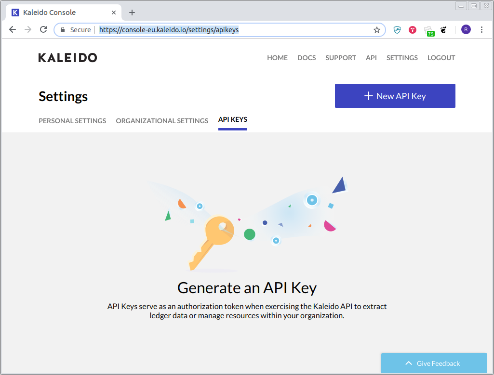

# GDG DevFest 2018 - Cloud Track


## Local Development (not using Google Cloud Console)

### Installing Terraform

#### MacOs
* `brew install terraform` - https://brewformulas.org/Terraform

### Linux
* Download the terraform binary - https://www.terraform.io/downloads.html
* Make sure is available on the PATH. You need to add it to your ~/.profile or ~/.bashrc file. 
    ```
    export PATH="$PATH:/path/to/terraform"
    ```
* Then update
    ```
    source ~/.profile 
    or
    source ~/.bashrc
    ```

### Installing go

#### Using Binaries for Windows, MacOs and Linux
* https://golang.org/dl/


#### MacOs (Brew)
* `brew install go` - https://formulae.brew.sh/formula/go
#### Ubuntu
* https://github.com/golang/go/wiki/Ubuntu

#### Other Linux
* Use tarballs - https://dl.google.com/go/go1.11.2.linux-amd64.tar.gz

### Setting up GOPATH
* https://github.com/golang/go/wiki/SettingGOPATH


### Optional: Visual Studio Code

### Go extension
* https://marketplace.visualstudio.com/items?itemName=ms-vscode.Go

## Aditional activity: Provisioning of Ethereum Consortium

### Create your kaleido account in EU region, [Get started](https://kaleido.io/get-started/)


### Create a [New API KEY](https://console-eu.kaleido.io/settings/apikeys)


* Export both the API URL and the API KEY as follows
```
export TF_VAR_kaleido_api=https://console-eu.kaleido.io/api/v1
export TF_VAR_kaleido_api_key=<YOUR-KEY>
```
### Clone the terraform-provider-kaleido repo
```
git clone git@github.com:kaleido-io/terraform-provider-kaleido.git
```

### Build the provider

```
go build -o terraform-provider-kaleido
```

### Move the binary to the terraform plugin directory

```
chmod +x terraform-provider-kaleido
mv terraform-provider-kaleido ~/.terraform.d/plugins/
```

### Create the Consortium

* Clone this repo and run

```
terraform init #You should have the `main.tf` in your current repository.
terraform plan
terraform apply
```